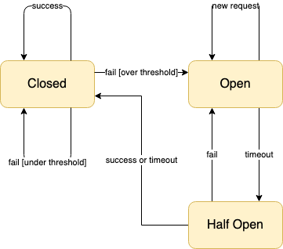

## What is the circuit-breaker plugin

It's is a plugin for [Kong](https://github.com/Mashape/kong) which implements the Circuit Breaker pattern and adds fault tolerance and resiliency at the API Gateway level. It depends on the **circuit-breaker** library which was inspired from the [moonbreaker library](https://github.com/Invizory/moonbreaker).
## How does it work

Each worker nginx process creates a table to maintain the state of all circuit breakers. A circuit breaker instance is created for each API it is enabled on.
1. If the plugin is enabled globally, then a circuit breaker instance is created for all API's. 
2. If the plugin is enabled on a service, then a circuit breaker instance is created for all API's of the service.
3. If the plugin is enabled on a route, then a circuit breaker instance is created for that route.

Similar to Kong, the most specific plugin settings are referred while creating the circuit breaker instance.

The core circuit breaking logic resides in the **circuit-breaker** library. Each circuit breaker instance maintains counters which are then used to manipulate the state of the circuit breaker. The following DFA explains the state transitions-

 

## Installation

If you're using `luarocks` execute the following:

     luarocks install circuit-breaker

You also need to add **circuit-breaker** to the `KONG_PLUGINS` environment variable. 

     export KONG_PLUGINS=circuit-breaker
     
### Parameters

| Parameter | Default  | Required | description |
| --- | --- | --- | --- |
| `min_calls_in_window` | 20 | true | min number of sample requests after which circuit breaker calculation starts |
| `window_time` | 10 | true | size of window (Closed state) in seconds, after which all counters are reset |
| `api_call_timeout_ms` | 2000 | true | upstream timeout value in ms, overrides timeout in Service settings |
| `failure_percent_threshold` | 51 | true | error Threshold after which circuit breaker transitions from closed to open or half-open to open |
| `wait_duration_in_open_state` | 15 | true | timeout value in seconds after which circuit breaker transitions from open state to half-open state |
| `wait_duration_in_half_open_state` | 120 | true | timeout value in seconds after which circuit breaker transitions from half-open state to closed state |
| `half_open_max_calls_in_window` | 10 | true | max calls allowed in half open state |
| `half_open_min_calls_in_window` | 5 | true | min number of sample requests after which circuit breaker calculation starts in half-open state |
| `error_status_code` | 599 | true | status code to return in open state or half-open state (after min calls) |
| `error_msg_override` |  | false | error message (body) to return in open state or half-open state (after min calls) |
| `response_header_override` |  | false | stringified lua table of headers to send in error response |
| `excluded_apis` | {"GET_/healthcheck": true} | true | stringified lua table of apis to exclude |

### Running Unit Tests

TBD